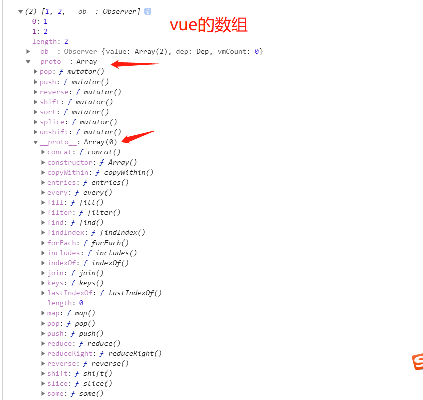

# Vue.set 实现原理

## 用法
**向响应式对象中添加一个 property，并确保这个新 property 同样是响应式的，且触发视图更新**。它主要用于向响应式对象上添加新 property，因为 Vue 无法探测普通的新增 property (比如 `this.myObject.newProperty = 'hi'`)

> 注意1：对象不能是 Vue 实例，或者 Vue 实例的根数据对象。  
> 注意2：对象也可以是已有的响应式属性或普通对象。

参考：  
[Vue.set API](https://cn.vuejs.org/v2/api/#Vue-set)  
[深入响应式原理](https://cn.vuejs.org/v2/guide/reactivity.html#%E6%A3%80%E6%B5%8B%E5%8F%98%E5%8C%96%E7%9A%84%E6%B3%A8%E6%84%8F%E4%BA%8B%E9%A1%B9)

## 源码分析
> Vue.set 和 vm.$set 实现方式一致，这里讲 vm.$set。


**vm.$set() 在 new Vue() 时候就被注入到Vue的原型上。**  
源码位置: vue/src/core/instance/index.js  
```js
// Vue 入口文件
import { initMixin } from './init'
import { stateMixin } from './state'
import { renderMixin } from './render'
import { eventsMixin } from './events'
import { lifecycleMixin } from './lifecycle'
import { warn } from '../util/index'

function Vue (options) {
  if (process.env.NODE_ENV !== 'production' &&
    !(this instanceof Vue)
  ) {
    warn('Vue is a constructor and should be called with the `new` keyword')
  }
  this._init(options)
}

initMixin(Vue)
// 给Vue原型绑定代理属性：$props, $data
// 给Vue原型绑定三个实例方法: vm.$watch，vm.$set，vm.$delete
stateMixin(Vue)

// 给Vue原型绑定事件相关的实例方法: vm.$on, vm.$once ,vm.$off , vm.$emit
eventsMixin(Vue)

// 给Vue原型绑定生命周期相关的实例方法: vm.$forceUpdate, vm.destroy, 以及私有方法_update
lifecycleMixin(Vue)

// 给Vue原型绑定生命周期相关的实例方法: vm.$nextTick, 以及私有方法_render, 以及一堆工具方法
renderMixin(Vue)

export default Vue
```

**stateMixin()**
```js
...
  Vue.prototype.$set = set
  Vue.prototype.$delete = del
...
```

**set()**  
源码位置: vue/src/core/observer/index.js
```js
export function set (target: Array<any> | Object, key: any, val: any): any {
  // 如果 set 函数的第一个参数是 undefined 或 null 或者是原始类型值，那么在非生产环境下会打印警告信息
  // 这个api本来就是给对象与数组使用的
  if (process.env.NODE_ENV !== 'production' &&
    (isUndef(target) || isPrimitive(target))
  ) {
    warn(`Cannot set reactive property on undefined, null, or primitive value: ${(target: any)}`)
  }
  if (Array.isArray(target) && isValidArrayIndex(key)) {
    // 类似$vm.set(vm.$data.arr, 0, 3)
    // 修改数组的长度, 避免索引>数组长度导致splcie()执行有误
    target.length = Math.max(target.length, key)
    // 利用数组的splice变异方法触发响应式, 这个前面讲过
    target.splice(key, 1, val)
    return val
  }
  // target为对象, key在target或者target.prototype上。
  // 同时必须不能在 Object.prototype 上
  // 直接修改即可, 有兴趣可以看issue: https://github.com/vuejs/vue/issues/6845
  if (key in target && !(key in Object.prototype)) {
    target[key] = val
    return val
  }
  // 以上都不成立, 即开始给target创建一个全新的属性
  // 获取Observer实例
  const ob = (target: any).__ob__
  // Vue 实例对象拥有 _isVue 属性, 即不允许给Vue 实例对象添加属性
  // 也不允许Vue.set/$set 函数为根数据对象(vm.$data)添加属性
  if (target._isVue || (ob && ob.vmCount)) {
    process.env.NODE_ENV !== 'production' && warn(
      'Avoid adding reactive properties to a Vue instance or its root $data ' +
      'at runtime - declare it upfront in the data option.'
    )
    return val
  }
  // target本身就不是响应式数据, 直接赋值
  if (!ob) {
    target[key] = val
    return val
  }
  // 进行响应式处理
  defineReactive(ob.value, key, val)
  ob.dep.notify()
  return val
}
```

接下来分析`set()`函数：  
```js
if (process.env.NODE_ENV !== 'production' &&
  (isUndef(target) || isPrimitive(target))
) {
  warn(`Cannot set reactive property on undefined, null, or primitive value: ${(target: any)}`)
}
```
isUndef是判断target是不是等于undefined或者null。isPrimitive是判断target的数据类型是不是string、number、symbol、boolean中的一种。这里判断的目的是：如果当前环境不是生产环境，并且 isUndef(target) || isPrimitive(target) 为真，那么就抛出错误警告。  

#### 数组的实现
```js
if (Array.isArray(target) && isValidArrayIndex(key)) {
  target.length = Math.max(target.length, key)
  target.splice(key, 1, val)
  return val
}
```
这里实际就是修改数组时调用 `set` 方法，然后让我们能够触发响应部分的代码。不过在分析这段代码之前我们来看看vue中数组改变是如何触发视图更新的。下图分别是vue中的数组和普通的js数组：


源码位置：
```js
import { def } from '../util/index'

const arrayProto = Array.prototype
export const arrayMethods = Object.create(arrayProto)

/**
 * Intercept mutating methods and emit events
 */
;
[
    'push',
    'pop',
    'shift',
    'unshift',
    'splice',
    'sort',
    'reverse'
]
.forEach(function(method) {
  // cache original method
  const original = arrayProto[method]
  def(arrayMethods, method, function mutator(...args) {
    const result = original.apply(this, args)
    const ob = this.__ob__  // vm实例或组件根实例
    let inserted
    switch (method) {
      case 'push':
      case 'unshift':
        inserted = args
        break
      case 'splice':
        inserted = args.slice(2)
        break
    }
    if (inserted) ob.observeArray(inserted)
    // notify change
    ob.dep.notify()
    return result
  })
})
```
但是在vue的数组中，数组原型其实不是指向Array.prototype的，而是指向一个对象（我们这里给这个对象命名为arrayMethods）。arrayMethods上面只有7个push、pop等方法，并且arrayMethods的原型才是指向的Array.prototype。所以我们在vue中调用数组的push、pop等方法时，其实不是直接调用的数组原型给我们提供的push、pop等方法，而是调用的arrayMethods给我们提供的push、pop等方法。  
vue为什么要给数组的原型链上面加上这个arrayMethods呢？这里涉及到了vue的数据响应的原理，我们这篇文章暂时不谈论数据响应原理的具体实现。这里你可以理解成vue在arrayMethods对象中做过了特殊处理，如果你调用了arrayMethods提供的push、pop等7个方法，那么它会触发当前收集的依赖（这里收集的依赖可以暂时理解成渲染函数），导致页面重新渲染。换句话说，对于数组的操作，我们只有使用arrayMethods提供的那7个方法才会导致页面渲染。

搞清楚vue中的数组具体是怎么实现了之后，我们再来看上面的代码：  
```js
if (Array.isArray(target) && isValidArrayIndex(key)) {
  target.length = Math.max(target.length, key)
  target.splice(key, 1, val)
  return val
}
```
首先if判断当前target是不是数组，并且key的值是有效的数组索引。然后将target数组的长度设置为target.length和key中的最大值，这里为什么要这样做呢?是因为我们可能会进行下面这种骚操作：
```js
arr1 = [1, 3];
Vue.set(arr1, 10, 1)  // 如果不那样做，这种情况就会出问题
```
接着向下看，我们发现这里直接调用了target.splice(key, 1, val)，在前面我们说过调用arrayMethods提供的push、pop等7个方法可以导致页面重新渲染，刚好splice也是属性arrayMethods提供的7个方法中的一种。  
总结一下Vue.set数组实现的原理：其实Vue.set()对于数组的处理其实就是调用了splice方法，是不是发现其实很简单~~

#### 对象的实现原理
接着看代码：
```js
if (key in target && !(key in Object.prototype)) {
  target[key] = val
  return val
}
```
这里先判断如果key本来就是对象中的一个属性，并且key不是Object原型上的属性。说明这个key本来就在对象上面已经定义过了的，直接修改值就可以了，可以自动触发响应。

关于对象的依赖收集和触发原理我们本文也不做详细解释，你可以暂时先这样理解。vue是使用的Object.defineProperty给对象做了一层拦截，当触发get的时候就会进行依赖收集（这里收集的依赖还是像数组那样，理解成渲染函数），当触发set的时候就会触发依赖，导致渲染函数执行页面重新渲染。那么第一次是在哪里触发get的呢？其实是在首次加载页面渲染的时候触发的，这里会进行递归将对象的属性都依赖收集，所以我们修改对象已有属性值得时候会导致页面重新渲染。这也刚好解释了我们使用 vueInstance.$data.obj1.b = 3; 的时候为什么页面不会重新渲染，因为这里的属性b不是对象的已有属性，也就是说属性b没有进行过依赖收集，所以才会导致修改属性b的值页面不会重新渲染。

我们接着向下看代码：
```js
const ob = (target: any).__ob__
if (target._isVue || (ob && ob.vmCount)) {
  process.env.NODE_ENV !== 'production' && warn(
    'Avoid adding reactive properties to a Vue instance or its root $data ' +
    'at runtime - declare it upfront in the data option.'
  )
  return val
}
if (!ob) {
  target[key] = val
  return val
}
```
首先定义变量ob的值为 target.__ob__，这个__ob__属性到底是什么对象呢？vue给响应式对象都加了一个__ob__属性，如果一个对象有这个__ob__属性，那么就说明这个对象是响应式对象，我们修改对象已有属性的时候就会触发页面渲染。

target._isVue || (ob && ob.vmCount) 的意思是：当前的target对象是vue实例对象或者是根数据对象，那么就会抛出错误警告。

if (!ob)为真说明当前的target对象不是响应式对象，那么直接赋值返回即可。

接着向下看：
```js
defineReactive(ob.value, key, val)
ob.dep.notify()
return val
```

这里其实才是vue.set()真正处理对象的地方。defineReactive(ob.value, key, val)的意思是给新加的属性添加依赖，以后再直接修改这个新的属性的时候就会触发页面渲染。

ob.dep.notify()这句代码的意思是触发当前的依赖（这里的依赖依然可以理解成渲染函数），所以页面就会进行重新渲染。  


参考：  
[Vue源码: 关于vm.$set()内部原理](https://juejin.im/post/6844903830837002253)   
[从vue源码看Vue.set()和this.$set()](https://www.cnblogs.com/heavenYJJ/p/9559439.html)
